# Medical Report Analyzer and Lab Test Ordering Portal

## Abstract
The Medical Report Analyzer and Lab Test Ordering Portal is a frontend web application developed to simplify two important healthcare-related activities: understanding medical reports and managing laboratory test orders. Many patients find laboratory reports difficult to interpret because the values, abbreviations, and clinical terms are technical in nature. At the same time, test ordering systems often focus only on booking the test and do not provide a structured place to analyze reports, track order progress, or record collection addresses clearly. This project addresses both needs in a single web-based platform.

The application allows users to upload PDF, DOCX, or TXT medical reports, extract measurable health parameters, compare them against configured reference ranges, calculate a wellness score, and generate user-friendly findings with food and lifestyle guidance. In addition, the system supports login, lab test catalogue browsing, online test ordering, address capture for sample collection, order history tracking, result attachment, and doctor review notes. Built with React and Vite, the project demonstrates how a modern frontend application can improve usability, clarity, and workflow efficiency in health-related digital systems.

## Introduction
Healthcare data is increasing rapidly, but for many patients and even for some non-technical healthcare staff, medical reports remain difficult to read and act upon. A typical lab report contains many values such as glucose, cholesterol, vitamin levels, hemoglobin, and blood pressure indicators. Without proper explanation, users may either ignore important abnormalities or panic over values they do not fully understand.

This project was designed to create a simple, calm, and structured digital experience for report interpretation and lab test ordering. The system combines report analysis with test ordering workflow in one interface. It focuses on making information understandable, visually clear, and practically useful. Instead of only displaying raw values, the application explains whether a parameter is normal, high, or low, summarizes key health concerns, visualizes outcomes through charts, and suggests food or lifestyle guidance.

The project also extends beyond analysis by supporting patient login, laboratory order creation, collection address entry, order status tracking, result attachment, and doctor review comments. This integrated approach improves continuity from test booking to result review.

## Problem Statement
Existing healthcare interfaces often suffer from the following problems:

1. Medical reports are difficult for common users to understand due to technical terms and raw numerical presentation.
2. Patients are often unable to quickly identify which parameters are normal and which need attention.
3. Many systems provide ordering functionality without connecting it clearly to result analysis and follow-up workflow.
4. Sample collection address details are often missing or poorly structured, creating confusion during home collection or visit planning.
5. Users need a smoother way to track order progress, attach results, and maintain doctor review notes in one place.

Because of these issues, there is a need for a user-friendly web application that can interpret lab reports in plain language while also supporting test ordering, order history, and address-aware workflow management.

## Project Flow Diagram

```mermaid
flowchart LR
    A([User Opens Portal]):::entry --> B{Login Required?}:::decision
    B -->|Yes| C[Login / Create Session]:::process
    B -->|Already Signed In| D[Access Dashboard]:::process
    C --> D

    D --> E[Browse Home and Test Catalogue]:::ui
    D --> F[Upload Medical Report]:::ui
    D --> G[Create Lab Test Order]:::ui

    F --> H[Read PDF / DOCX / TXT File]:::engine
    H --> I[Normalize Text]:::engine
    I --> J[Extract Measurements]:::engine
    J --> K[Compare with Reference Ranges]:::engine
    K --> L[Generate Issues and Wellness Score]:::engine
    L --> M[Show Charts, Summary, and Food Guidance]:::result
    M --> N[Download Analysis Summary]:::result

    G --> O[Enter Patient Details]:::form
    O --> P[Add Sample Collection Address]:::form
    P --> Q[Select Required Lab Tests]:::form
    Q --> R[Create Order]:::process
    R --> S[Store Order in Local Portal History]:::storage

    S --> T[Track Status: Ordered to Reviewed]:::result
    T --> U[Attach Analysis Result to Order]:::result
    U --> V[Doctor Adds Review Notes]:::result
    V --> W([Complete Patient Record View]):::entry

    classDef entry fill:#1b4f72,stroke:#0f2f44,color:#ffffff,stroke-width:2px;
    classDef decision fill:#f6c667,stroke:#a86d00,color:#402500,stroke-width:2px;
    classDef process fill:#7cc6a8,stroke:#2f6d57,color:#123126,stroke-width:2px;
    classDef ui fill:#9cc9f5,stroke:#376f9b,color:#0f2740,stroke-width:2px;
    classDef engine fill:#d5b3ff,stroke:#6a3ea1,color:#2c114a,stroke-width:2px;
    classDef form fill:#f7d9e7,stroke:#a54b77,color:#4a1930,stroke-width:2px;
    classDef result fill:#b8e3c8,stroke:#35734d,color:#15301f,stroke-width:2px;
    classDef storage fill:#cfd8e6,stroke:#58677d,color:#1e2733,stroke-width:2px;
```

## Objectives with Justification

### 1. To simplify medical report interpretation
Justification: Most users cannot easily understand clinical report values. This project converts complex data into a readable summary with clear findings and wellness scoring.

### 2. To identify normal and abnormal health parameters automatically
Justification: Automated comparison against reference ranges helps users quickly identify which measurements are stable and which require attention.

### 3. To provide practical food and lifestyle guidance
Justification: Merely identifying a problem is not enough. The project adds simple improvement suggestions that make the application more useful and action-oriented.

### 4. To integrate lab test ordering with report analysis
Justification: In many systems, analysis and ordering are separate activities. This project combines both, improving continuity for the user.

### 5. To support address-based sample collection workflow
Justification: A structured address block is essential for home collection, proper dispatch, and operational clarity.

### 6. To maintain order history and review tracking
Justification: Users need to see order progress, attached results, and doctor review comments in one place for better record management.

### 7. To build a responsive modern frontend application
Justification: A web-based solution developed with React and Vite ensures fast interaction, modular design, and accessibility across common devices.

## Modules [Frontend Web Pages]

### 1. Home Page
The Home page introduces the portal and explains the core workflow. It acts as the landing screen and helps users begin report analysis quickly.

### 2. Login Page
The Login page allows the user to create a local session before placing an order. This connects the order workflow with the currently signed-in user.

### 3. Report Upload and Analysis Page
This module allows users to upload PDF, DOCX, or TXT files. The uploaded report is processed locally in the browser, measurements are extracted, risks are identified, and the result is shown using score cards, tables, and charts.

### 4. Results Dashboard
This section displays wellness score, abnormal markers, normal parameters, extracted lab values, issue explanations, food guidance, and chart-based visual analytics.

### 5. Lab Test Catalogue Page
The Catalogue page lists available lab tests, their categories, reference ranges, and severity weights used in interpretation.

### 6. Order Lab Test Page
This page allows users to create a test order by entering patient details, selecting priority, choosing tests, and filling in the sample collection address.

### 7. Order History and Tracking Page
This page shows all created orders, current order status, order timeline, attached results, collection address, and doctor review information.

### 8. About Page
This module explains the purpose of the website, its educational nature, and the value it provides to users.

## Expected Outcomes of the Proposed Work
The proposed system is expected to produce the following outcomes:

1. A clean and interactive web portal for medical report analysis and lab test ordering.
2. Faster understanding of lab reports through automatic extraction and interpretation of important measurements.
3. Clear distinction between normal and abnormal findings using tables, score cards, and charts.
4. Better user guidance through food and lifestyle recommendations linked to detected issues.
5. Improved lab workflow through structured test ordering, address capture, and order tracking.
6. Better continuity from report upload to doctor review within the same application.
7. A scalable frontend architecture using reusable React modules and component-driven logic.

## Conclusion
The Medical Report Analyzer and Lab Test Ordering Portal is a practical and user-oriented frontend healthcare application. It addresses a real problem by converting difficult medical report data into an understandable, structured, and visually guided format. At the same time, it strengthens the laboratory ordering process by including login, patient details, sample collection address, order history, result attachment, and doctor review support.

This project demonstrates how modern web technologies can be used to improve healthcare communication and workflow clarity. Although the current implementation is frontend-only and uses local storage for persistence, it establishes a strong foundation for future enhancement through backend integration, secure authentication, cloud storage, and real-time laboratory workflow support.

## References
1. Project source files and implementation notes from this repository, especially README and the modules for analysis, order management, and data configuration.
2. React Documentation. https://react.dev/
3. Vite Documentation. https://vitejs.dev/
4. Chart.js Documentation. https://www.chartjs.org/docs/latest/
5. Bootstrap Documentation. https://getbootstrap.com/docs/
6. Mozilla PDF.js Documentation. https://mozilla.github.io/pdf.js/
7. Mammoth.js Documentation. https://github.com/mwilliamson/mammoth.js

## Short Presenter Notes
If you need to speak briefly for each slide, use this sequence:

1. Start with the problem: medical reports are difficult to understand and order workflows are incomplete.
2. Explain the solution: one portal for report analysis, ordering, tracking, and review.
3. Walk through the diagram from login to upload, analysis, order creation, and final review.
4. Highlight the special features: wellness score, charts, food guidance, address block, and history tracking.
5. End with future scope: backend integration, secure authentication, database storage, and real-time hospital deployment.